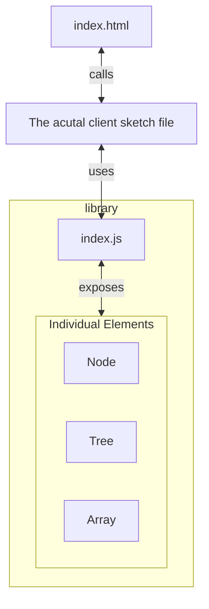

# p5.viz

A p5.js library for visualization stuff written in TypeScript.

## Generic Flow

```mermaid
flowchart TB
    html[index.html] <--calls--> main[The acutal client sketch file]

    main <--uses--> index[index.js]

    subgraph library
        index <--exposes--> library-elms

        subgraph library-elms[Individual Elements]
            node[Node]

            tree[Tree]

            array[Array]
        end
    end
```