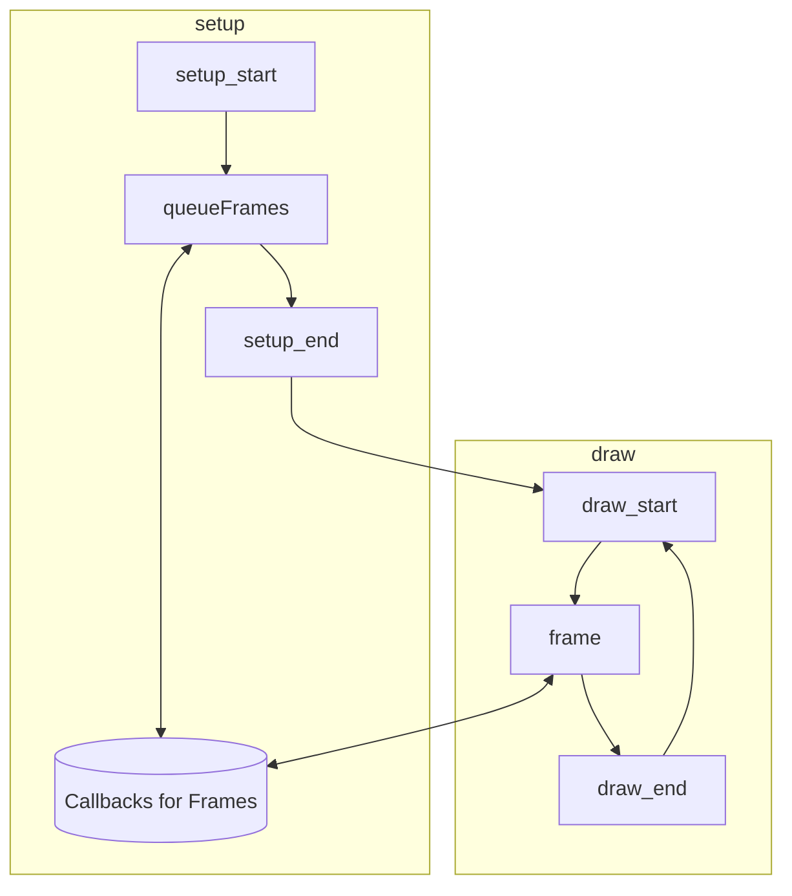

# p5.viz

A p5.js library for visualization stuff written in TypeScript.


## Example calls

```js

frames = [];

queueFrame(method) {
    frames.push(method);
}

frame() {
    for frame_desc of frames {
        frame_desc();
    }
}

setup() {
    node = node(pos, size, txt);

    queueFrame(highlight(node), style, [timing]);
}

draw() {
    frame(frameCount);
}

// 60 FPS by default
while(true) {
    draw();
}
```

## Design

