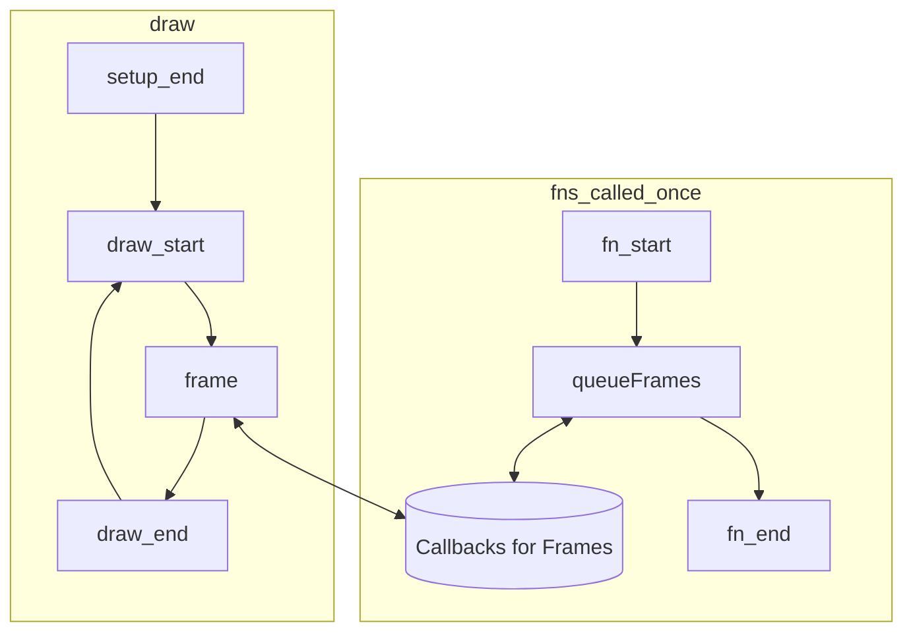
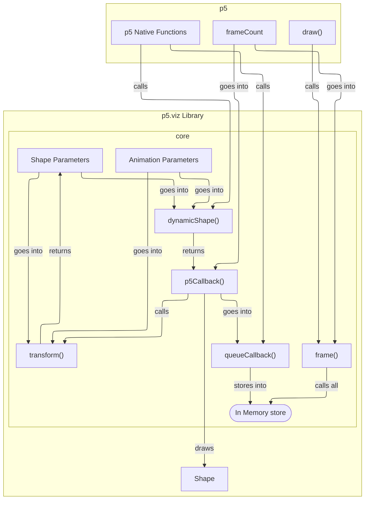

# p5.viz

A p5.js library for visualization stuff written in TypeScript.

## Some Defining terms

Any p5.js sketch has following anatomy,

1. **setup:** It gets called at the very begining of the sketch once.
2. **draw:** It gets called repeatedly (60 times a second).
3. **event handlers:** These get called on different events that happens on the canvas. E.g., mouseClicked(), keyPressed() etc.

Every animation is made out of a sequence of images(referred to as frame). draw() places each frame. As draw is the ultimate artist for animation we make sure draw always gets to place the frames.

Mathematically an animation can be though of as a function of framecount. Formally,

$$
a: F \rightarrow D
$$

where,

- $a$ defines the animation
- $F = \mathbb{Z}^+$
- $D = \left\{ d \; | d \; \in \mathcal{P}(P) \right\}$
- $P = \text{Set of all pixels on screen}$

So, calling $a$ with a frame number makes it draw out the figure for that perticular frame. So if we call $a$ with all possible valid frame count and play them in order it will carry out the animation.


## Example calls


## Framework Call

```js

setup() {
    queueFrame(dynamicCircle(...));
}

draw() {
    frame(frameCount);
}
```

## Dynamic Variants

```ts
dynamicCircle(circleParams: P5CircleParams, animationParams: DynamicAnimationParams): DynamicP5Object
```

## Design

**Framework Usage**


It is evident that draw should not hold static things

**Code level design**



## Implementation plans
**core:**
```ts
type AnimationParams = {
    firstFrameCount: number,
    
    // ...
};
type P5Callback = (p: p5, currentFrameCount: number) => void;
type DynamicShape = (shapeParams: object, animationParams: AnimationParams) => P5Callback;

// ...

let callbacks: P5Callback[] = [];
function queueCallback(callback: P5Callback): void {
    callbacks.push(callback);
}

function frame(p: p5, currentFrameCount: number): void {
    for (callback of callbacks) {
        callback(p, currentFrameCount);
    }
}
```
